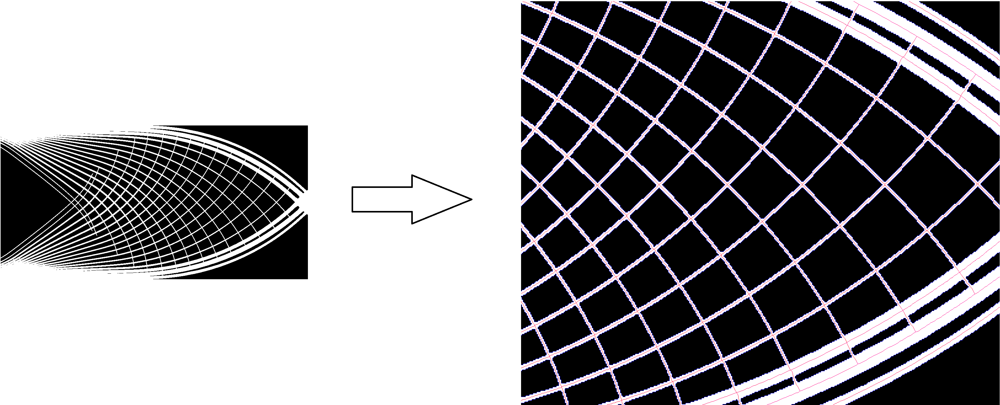
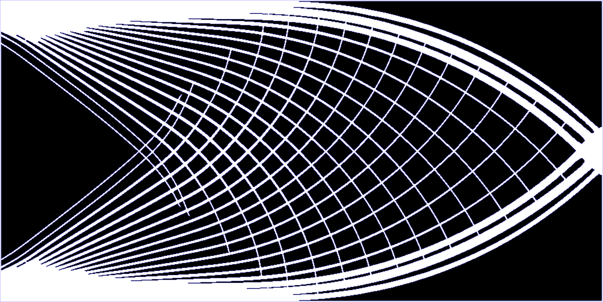
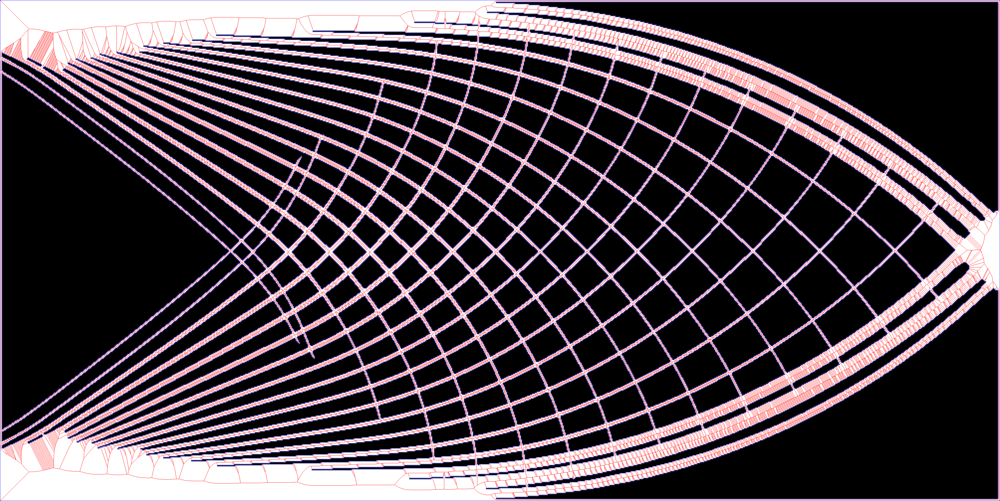
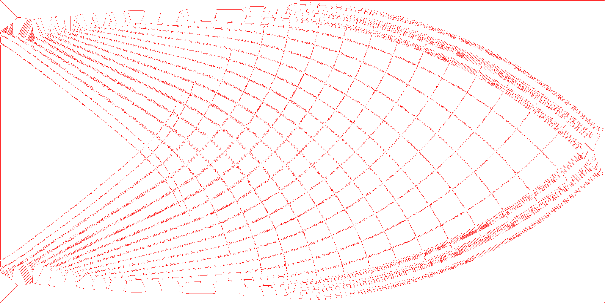
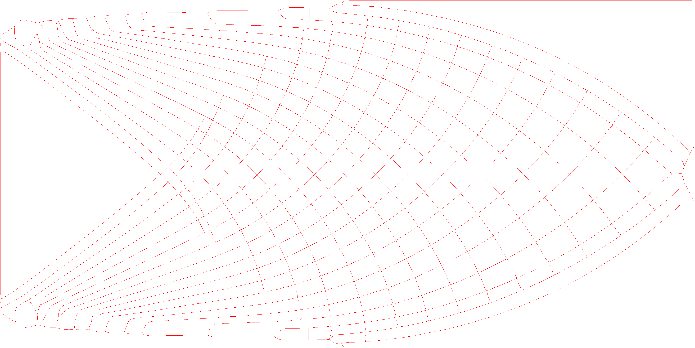
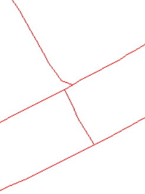
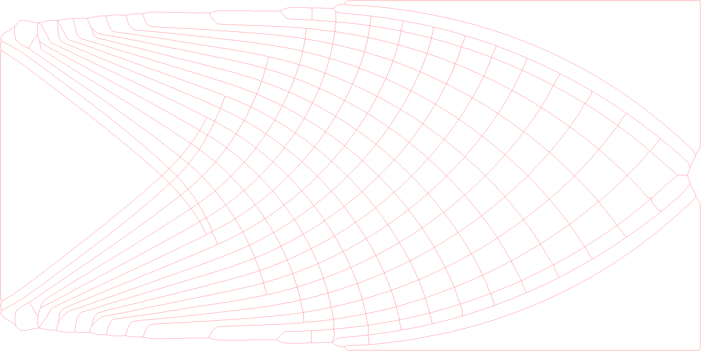

# Finding the medial axis

## Goal

We would like to find the medial axis of a given image. To do so, we use a couple techniques in order to clean up the image and find the medial axis.

Currently our approach uses the following techniques:

1. [**Image Preprocessing**](#image-preprocessing): We use a series of filters to clean up the image before running further algorithms.
2. [**Edge detection**](#edge-detection): We use opencv to detect edges in the image (findContours), we also apply canny edge detection to find the edges of the image.
3. [**Voronoi Diagram**](#voronoi-diagram): We calculate and use a voronoi diagram (as a graph).
4. [**Final filtering**](#final-filtering): We apply a series of algorithms to clean up the voronoi diagram and find the medial axis.

for example:



The medial axis of the image is in red/pink.

## Image preprocessing

We use a series of filters to clean up the image before running further algorithms.

### Removing islands

First of all we take the image and remove any islands (small black patches) from the image. We do this by using the following algorithm:

```{code-block} algo
For each pixel in the image, if the pixel is black and we did not already used it:
	count the number of black pixels we can reach from that pixel using other black pixels.
	if the number of black pixels is less than a threshold:
		paint all the black pixels we went over to white.
```
Using dynamic programing we can reduce the runtime greatly and do it in *O(n)* where *n* is the number of pixels in the image.

### Adding border

If a given flag is given we add a white border (2 pixel wide rectangle) to the picture (this connects all the borders of the image and help with further processing of the voronoi later on if the original image uses the edges of the image as it's border).

### Resizing

In order to get a more accurate result for the medial axis we scale the image up to be more precise.

We use bilinear interpolation for the scaling as we saw it produced good results.

## Edge detection

We use a canny filter and then run findContours using openCV (as recommended by openCV) to detect edges of the image.

The resulting contours:

## Voronoi diagram

We run a voronoi diagram algorithm (using boost) to get the following diagrams (Removing all segments which are not in the original image white regions):





## Final filtering

We process the resulting voronoi diagram as a graph.

### Reducing graph

We reduce the graph by removing small edges (given a threshold) and contracting the vertices of each small edge, we do so iteratively until we can't reduce the graph anymore.

This enables us to work with a much smaller graph and process it faster.

### Removing hanging edges

We iteratively go over each leaf of the graph and walk until we reach a vertex with more than 2 edges (a junction), we then remove the leaf and all the edges we went over if the path is shorter than a given threshold.

The resulting graph is:


### Collapsing junctions

After the previous step we have some artificats left to deal with, as we can see in the following image:



So we want to collapse junctions which are close to each other (given a threshold) and make them a single junction (using a graph walk between the two junctions and taking the average point when contracting the edge).
The 

### Smoothing junctions

We found because of the noise generated from approximating the junctions we should smooth the junctions a bit by 
making all the neighbors of a junction be of at least a certain distance from the junction (given a threshold), all vertices (that aren't junction) which are not at least the threshold distance from the junction are removed (creating a one long edge from the two edges which went out from the removed vertex).

The resulting graph is:


And we are done with the graph processing and got a medial axis!
